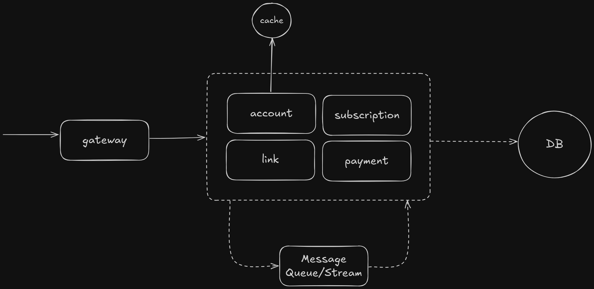
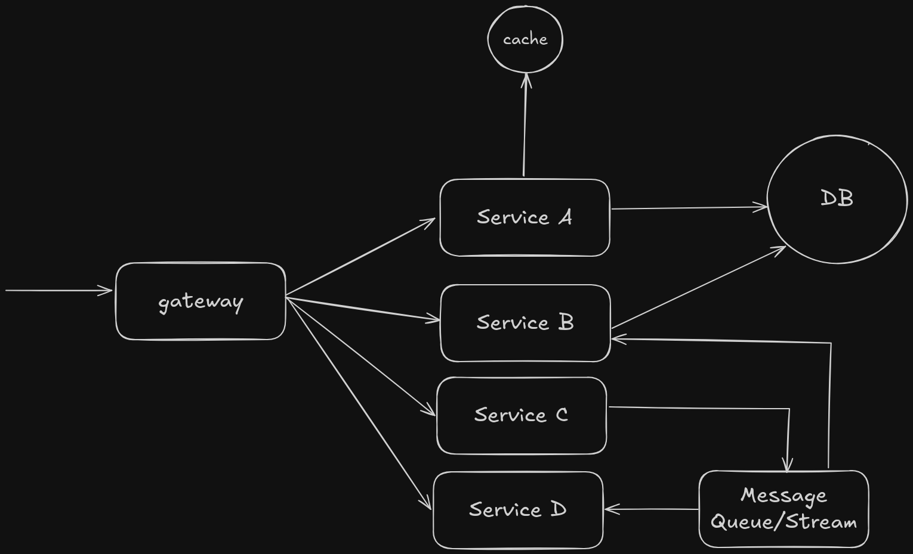
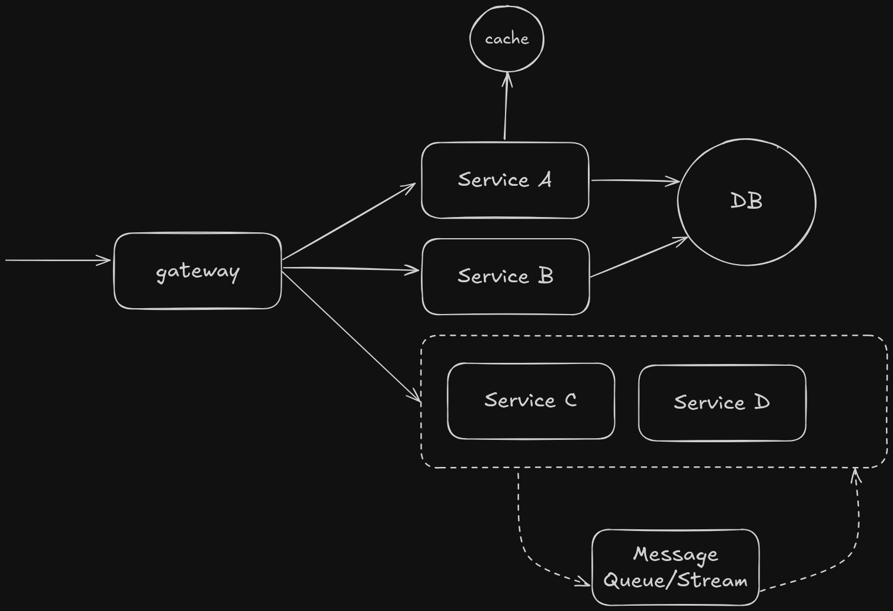

# Kochira

Annoyed seeing long links filling up the view or your precious writing space? 
Worry not, Kochira will ***show you the way*** to share links!

## Feature Roadmap

- [x] URL Shortener
- [ ] Premium perk subscription (simulation! 😁)
  - [x] Subscription-aware core feature
  - [ ] Purchasing/extending

## Developing 
This repository uses monorepo approach by relying on `go.work`. If you want to focus developing 
certain service, just imagine your scenario like this:

> What a good day to develop `subscription` and `account` service today...

Since we want to _work_ on these modules, our `go.work` file would be:
```
go <your_go_version>

use (
  ./lib
  ./subscription
  ./account
)
``` 

## Deploying
You could deploy this project in:

<details>
  <summary>monolith</summary>

  

  Run every service on a single container by:

  - Ensure `monolith/Dockerfile` populates container's `go.work` with path of every directory with `go.mod` on it
  - Ensure `docker-compose.yaml` uses every `.env` on it (the env had prefixed by service, so you don't need to worry about conflict)
  - Ensure `docker-compose.yaml` uses `monolith/` Dockerfile
  - Select build `target` you want and run it: `docker compose up -d` (add `--build` to force rebuild)
</details>

<details>
  <summary>microservices</summary>

  

  Run every service on their own container by:

  - Ensure `<service>/Dockerfile` populates container's `go.work` with `lib` and `<service>` path
  - Ensure `docker-compose.yaml` uses service's `.env` on it (the env had prefixed by service, so you don't need to worry about conflict)
  - Ensure `docker-compose.yaml` uses `<service>/` Dockerfile
  - Select build `target` you want and run it: `docker compose up -d` (add `--build` to force rebuild)
</details>

<details>
  <summary>hybrid</summary>

  

  Run some in single container while the others are on their own by:

  - Create `1 + n` containers where `n` is the number of services you want to run independently
  - Do the monolith steps, but leave out the services that you want to run independently
  - Do the microservice steps for every service you want to run independently
  - Run it: `docker compose up -d` (add `--build` to force rebuild)
</details>
